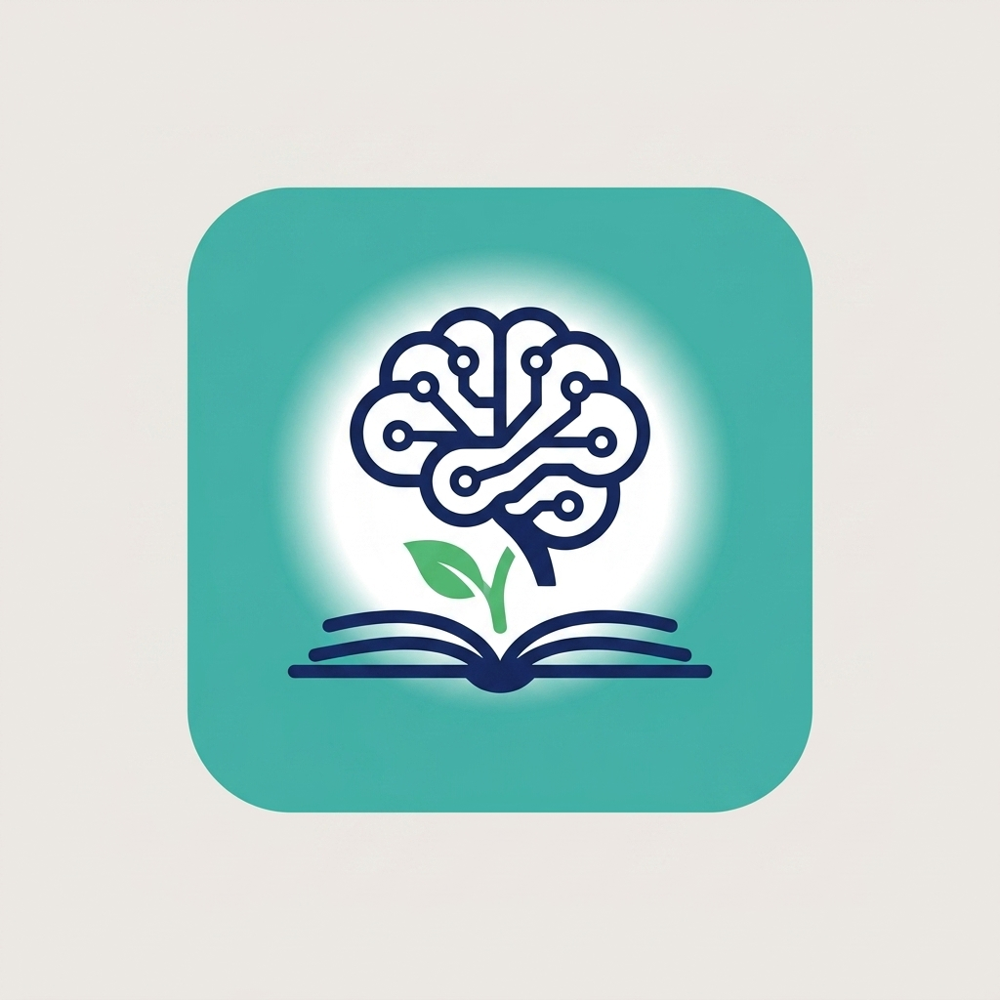

<p align="center">
  
</p>

<h1 align="center">EduBot — AI Academic Mentor</h1>

<p align="center">
  <em>Your Academic Concierge, Always Here</em>
</p>

<p align="center">
  
  
  
  
  
</p>

---

## 📖 Overview

**EduBot** is a cross-platform Flutter application that serves as an AI-powered academic assistant for college ecosystems. It connects **students** with an intelligent chatbot backed by Retrieval-Augmented Generation (RAG) and gives **mentors** a comprehensive dashboard to monitor student engagement, respond to issues, and intervene when needed.

The AI layer is powered by **Google Gemini** models, routed securely through **Supabase Edge Functions** — no API keys are ever exposed on the client.

---

## ✨ Features

### 🎓 Student Portal
| Feature | Description |
|---------|-------------|
| **AI Chat** | Conversational assistant with full RAG pipeline — answers grounded in uploaded documents |
| **Document Upload** | Upload timetables, marksheets, syllabi, attendance records (PDF/image) — automatically chunked, embedded, and indexed |
| **Smart Retrieval** | Queries against uploaded documents using vector similarity search (pgvector) |
| **Issue Reporting** | Submit academic, hostel, financial, or personal issues with priority levels |
| **Timetable Parsing** | Automatically detects and displays today's schedule from uploaded timetables |
| **Career Guidance** | Personalized advice based on the student's program, branch, and interests |

### 🧑‍🏫 Mentor Portal
| Feature | Description |
|---------|-------------|
| **Student Dashboard** | View all assigned students with engagement scores, conversation counts, and issue stats |
| **Chat Monitoring** | Read student–AI conversation threads and flag/resolve them |
| **Direct Intervention** | Send messages directly into a student's chat thread |
| **Issue Management** | Review, respond to, and resolve student-reported issues |
| **AI Assistant** | Dedicated mentor-mode AI chat for drafting emails, getting student insights, and planning interventions |
| **Class Overview** | Aggregated metrics — active students, open issues, and average engagement |

---

## 🏗️ Architecture

```
┌──────────────┐     ┌──────────────────┐     ┌──────────────────────┐
│  Flutter App  │────▶│  Supabase Edge   │────▶│  Google Gemini API   │
│  (Frontend)   │     │  Functions       │     │  (Chat + Embeddings) │
└──────┬───────┘     └──────────────────┘     └──────────────────────┘
       │
       ▼
┌──────────────────┐
│  Supabase        │
│  ├─ Auth         │
│  ├─ PostgreSQL   │
│  │  └─ pgvector  │
│  └─ Storage      │
└──────────────────┘
```

**Key design decisions:**
- **Providers handle state only** — no raw Supabase or HTTP calls in UI code
- **Services own all external I/O** — `SupabaseService` for DB, `AIService` for AI/embeddings
- **RAG pipeline** — documents → text extraction → chunking → batch embedding → pgvector storage → similarity search at query time
- **Barrel exports** — models are split into individual files but importable via a single `models.dart`

---

## 📂 Project Structure

```
lib/
├── main.dart                          # App entry point, Supabase init, Provider setup
├── models/
│   ├── models.dart                    # Barrel export
│   ├── user_model.dart                # Student / Mentor user profile
│   ├── conversation_model.dart        # Chat conversation metadata
│   ├── message_model.dart             # Individual chat messages
│   ├── student_document.dart          # Uploaded document records
│   ├── issue_report.dart              # Student issue submissions
│   └── student_progress_report.dart   # Aggregated student metrics
├── screens/
│   ├── splash_screen.dart             # Animated splash + auth routing
│   ├── auth_screen.dart               # Login / Register flows
│   ├── student/
│   │   ├── student_home_screen.dart       # Student tab navigation
│   │   ├── student_chat_screen.dart       # AI chat interface
│   │   ├── student_documents_screen.dart  # Document upload & indexing
│   │   └── student_issue_screen.dart      # Issue reporting
│   └── mentor/
│       ├── mentor_dashboard_screen.dart   # Multi-tab mentor hub
│       ├── mentor_ai_chat_screen.dart     # Mentor AI assistant
│       └── mentor_chat_view_screen.dart   # Student chat thread viewer
├── services/
│   ├── ai_service.dart                # Gemini chat, embeddings, RAG search
│   ├── auth_provider.dart             # Auth state management (ChangeNotifier)
│   ├── chat_provider.dart             # Chat state + RAG orchestration
│   └── supabase_service.dart          # All database CRUD operations
└── utils/
    ├── app_theme.dart                 # Color palette, typography, component themes
    └── constants.dart                 # API keys, table names, system prompts
```

---

## 🚀 Getting Started

### Prerequisites

- **Flutter SDK** ≥ 3.0.0
- **Dart SDK** ≥ 3.0.0
- A **Supabase** project with:
  - `pgvector` extension enabled
  - Edge Function `chat` deployed (handles Gemini API calls)
  - Database tables matching the schema below

### Installation

```bash
# 1. Clone the repository
git clone https://github.com/your-username/AI-Mentor.git
cd AI-Mentor

# 2. Install dependencies
flutter pub get

# 3. Configure Supabase credentials
#    Edit lib/utils/constants.dart and update:
#    - kSupabaseUrl       → Your Supabase project URL
#    - kSupabaseAnonKey   → Your Supabase anon/public key

# 4. Run the app
flutter run
```

### Generate App Icons *(optional)*

```bash
flutter pub run flutter_launcher_icons
```

---

## 🗄️ Database Schema

The app expects the following Supabase PostgreSQL tables:

| Table | Purpose |
|-------|---------|
| `users` | Student and mentor profiles (name, role, program, branch, semester, etc.) |
| `conversations` | Chat session metadata and status tracking |
| `messages` | Individual chat messages with sender role and AI-generation flag |
| `student_documents` | Uploaded document records (type, title, extracted text) |
| `document_chunks` | Chunked text with vector embeddings for RAG (`pgvector`) |
| `issue_reports` | Student-submitted issues with category, priority, and mentor response |
| `mentor_interventions` | Mentor direct messages injected into student chat threads |
| `attendance` | Student attendance records per subject |
| `academic_results` | Student grade and result records |
| `schedules` | Class timetable entries (day, time, subject, room) |

> **Note:** The `document_chunks` table requires the [`pgvector`](https://github.com/pgvector/pgvector) extension with a `vector(3072)` column for storing Gemini embeddings.

---

## 🧰 Tech Stack

| Layer | Technology |
|-------|-----------|
| **Framework** | Flutter 3.x (Android, iOS, Web) |
| **Language** | Dart 3.x |
| **State Management** | Provider (`ChangeNotifier`) |
| **Backend** | Supabase (Auth · PostgreSQL · Edge Functions · Storage) |
| **AI / LLM** | Google Gemini (`gemini-2.5-flash-lite` with fallbacks to `flash` and `pro`) |
| **Embeddings** | Gemini Embedding API (`gemini-embedding-001`, 3072 dimensions) |
| **Vector Search** | pgvector (cosine similarity via Supabase RPC) |
| **Typography** | Google Fonts — Playfair Display, Lato, Merriweather |
| **Markdown** | `flutter_markdown` for rendering AI responses |

---

## 📦 Dependencies

| Package | Version | Purpose |
|---------|---------|---------|
| [`supabase_flutter`](https://pub.dev/packages/supabase_flutter) | ^2.3.4 | Supabase client SDK (auth, database, functions) |
| [`provider`](https://pub.dev/packages/provider) | ^6.1.2 | Reactive state management |
| [`google_fonts`](https://pub.dev/packages/google_fonts) | ^6.2.1 | Custom typography from Google Fonts |
| [`flutter_markdown`](https://pub.dev/packages/flutter_markdown) | ^0.6.18 | Markdown rendering in chat bubbles |
| [`shared_preferences`](https://pub.dev/packages/shared_preferences) | ^2.2.2 | Local session persistence |
| [`intl`](https://pub.dev/packages/intl) | ^0.19.0 | Date and time formatting |
| [`image_picker`](https://pub.dev/packages/image_picker) | ^1.0.7 | Camera-based document capture |
| [`file_picker`](https://pub.dev/packages/file_picker) | ^8.0.3 | File system document selection |

---

## 🤖 RAG Pipeline

```
User Query
    │
    ▼
┌─────────────────┐
│ Embed Query      │  ← Gemini Embedding API (3072-dim vector)
└────────┬────────┘
         ▼
┌─────────────────┐
│ Vector Search    │  ← pgvector cosine similarity (top-k chunks)
└────────┬────────┘
         ▼
┌─────────────────┐
│ Context Assembly │  ← Retrieved chunks + student profile + academic data
└────────┬────────┘
         ▼
┌─────────────────┐
│ Gemini Chat      │  ← Supabase Edge Function → Gemini API
│ (grounded reply) │
└─────────────────┘
```

**Document ingestion flow:**  
Upload → Extract text → Split into chunks → Batch embed via Gemini → Store vectors in pgvector

**Query flow:**  
User message → Embed → Similarity search → Assemble context → Generate grounded response

---

## 🎨 Design System

The app uses a carefully curated **academic-inspired** palette:

| Token | Color | Usage |
|-------|-------|-------|
| `primary` | `#1A2B5F` | Navy — headers, buttons, student bubbles |
| `accent` | `#D4A843` | Gold — highlights, FABs, badges |
| `mentorBubble` | `#2D6A4F` | Forest green — mentor-specific elements |
| `surface` | `#F8F7F2` | Warm ivory — backgrounds |
| `success` | `#2D6A4F` | Confirmation states |
| `error` | `#C1121F` | Error states and alerts |

**Typography:** Playfair Display (headings) · Lato (body) · Merriweather (base theme)

---

## 📄 License

This project is licensed under the **MIT License** — see the [LICENSE](LICENSE) file for details.

---

<p align="center">
  Built with ❤️ using Flutter & Supabase
</p>
